# תכנון עיצוב מחדש ל־ProCount — Apple-style Daily Focus

**תאריך:** 2026-09-05

**בראנץ׳:** `feature/apple-ui-redesign`

**בסיס:** `origin/master` ב־`4583e23`

**סטטוס:** תכנון והמחשות בלבד; ללא שינויי קוד, נתונים או התנהגות מוצר

## מטרה

להפוך את ProCount למוצר שקט, ברור ומהיר יותר באייפון. כל מסך צריך לענות מיד על שאלה אחת, להציג פעולה ראשית אחת, ולהעביר פרטים משניים לשכבה הבאה במקום להעמיס אותם על המשתמש.

העיצוב שומר על ה־RTL, על Heebo, על ארבעת הטאבים ועל כל היכולות הקיימות. הוא אינו מוסיף פיצ׳רים, מודל נתונים או תלויות UI.

## עקרונות העיצוב

1. **מטרה לפני קישוט:** ירוק מייצג חלבון והצלחה, כתום קלוריות, כחול מים ואדום פעולה מסוכנת. אין זוהר קבוע או צבע ללא משמעות.
2. **היררכיה אחת:** בכל מסך יש כותרת אחת, נתון או משימה מרכזיים, ואז מידע משני.
3. **חשיפה הדרגתית:** פירוט ארוחות, כמויות מתקדמות ופעולות נדירות נפתחים לפי דרישה.
4. **מוכרות:** רשימות, טפסים, segmented controls, sheets וכפתורי ניווט מתנהגים כמו רכיבי iPhone מוכרים.
5. **שליטה וסלחנות:** משוב מיידי בלחיצה, ביטול לאחר הוספה, ואישור רק למחיקה שאינה ניתנת לשחזור.
6. **חומריות מאופקת:** תוכן על משטחים אטומים; שקיפות רק בניווט, toolbar ו־sheets צפים.

## מערכת חזותית משותפת

| תפקיד | ערך מוצע |
| --- | --- |
| רקע | `#070A09` |
| משטח | `#111512` |
| משטח מורם | `#171B18` |
| טקסט ראשי | `#F4F7F6` |
| טקסט משני | `#8A9994` |
| חלבון / פעולה ראשית | `#39E6B2` |
| קלוריות | `#FB923C` |
| מים | `#60A5FA` |
| סכנה | `#FB5D67` |
| רדיוס hero | `24px` |
| רדיוס משטח / sheet | `20px` / `28px` |
| יעד מגע מינימלי | `44px` |
| מרווח מסך | `20px`, ו־`16px` במסכים צרים |

- Heebo נשאר הפונט. כותרות גדולות מקבלות tracking שלילי עדין; טקסט גוף נשאר ללא tracking כפוי.
- מספרים מוצגים עם `font-variant-numeric: tabular-nums` ובידוד כיווניות במקום להסתמך על סדר RTL מקרי.
- גבולות משמשים להפרדה רק כשמרווח או שינוי משטח אינם מספיקים.
- אין glass על glass: אם ה־sheet שקוף מעט, התוכן שבתוכו אטום.

## מעטפת האפליקציה

- ארבעת הטאבים נשארים: **היום · תפריט · מגמות · מאכלים**.
- ה־header מציג כותרת אחת וכותרת משנה אחת. אין כותרת נוספת בתוך גוף המסך.
- הפעולה `+ הוסף מזון` היא pill גלוי מעל ה־tab bar במסכי היום, מגמות ומאכלים; היא מוסתרת בתפריט ובהגדרות.
- הגדרות נפתחות כמסך מלא. הוספה, עורך מאכל ופרטי רישום נשארים bottom sheets.
- כל padding תחתון נגזר ממשתני ה־safe-area הקיימים, ללא offsets לפי דגם מכשיר.

## מסכים

### 0. התחברות

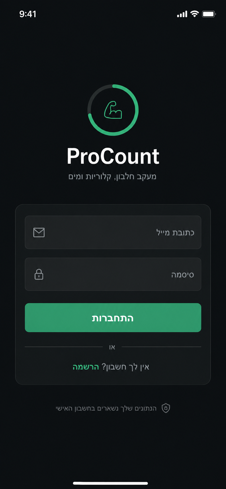

- לוגו קטן, שם המוצר ותיאור קצר; אין מסרים שיווקיים.
- מייל, סיסמה ו־CTA אחד בתוך משטח טופס מאוחד.
- מעבר להרשמה הוא פעולה משנית. אין ניווט תחתון.

### 1. היום

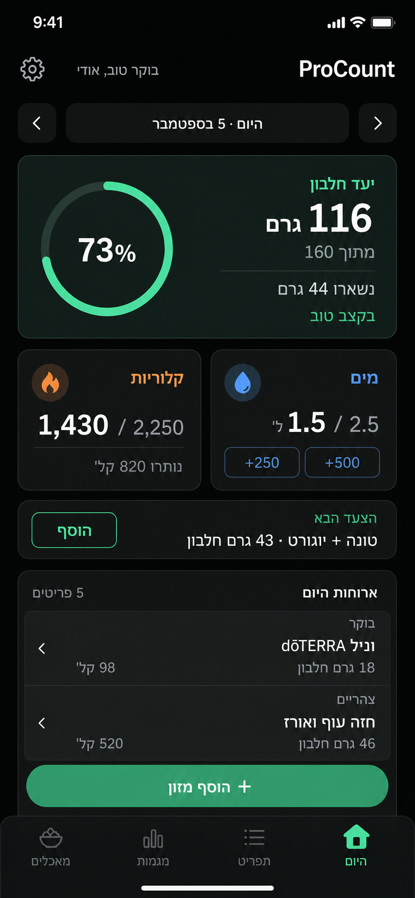

- כרטיס hero אחד מאחד חלבון, יתרה וקצב. כרטיס הקצב הנפרד יורד.
- קלוריות ומים מוצגים בשני tiles קומפקטיים.
- פעולות מים נפוצות נשארות גלויות; כמות מותאמת נפתחת דרך `אחר`.
- כרטיס העידוד הגנרי נמחק. המלצה מוצגת רק כשהיא ספציפית וברת פעולה.
- לפחות רישום מזון אחד צריך להופיע ב־viewport של `390×844` בלי גלילה.

### 2. מגמות

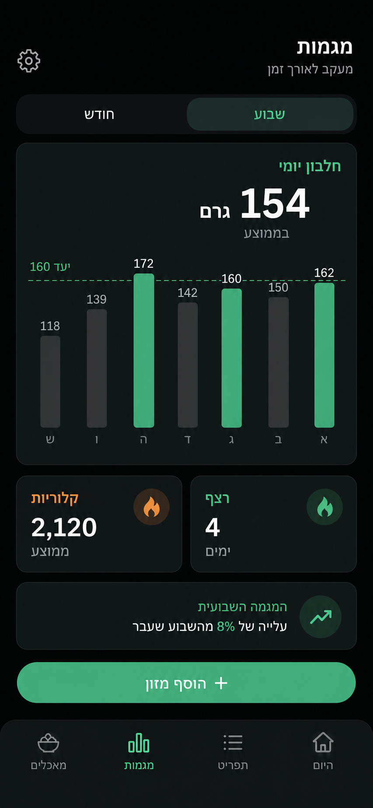

- segmented control של שבוע/חודש מופיע מיד מתחת לכותרת.
- ממוצע החלבון והגרף חולקים hero אחד; קו היעד נשאר ברור אך לא משתלט.
- רצף וממוצע קלוריות מקבלים tiles משניים.
- תובנה שבועית מופיעה רק אם ניתן לחשב אותה מהנתונים הקיימים; אין טקסט גנרי.

### 3. תפריט

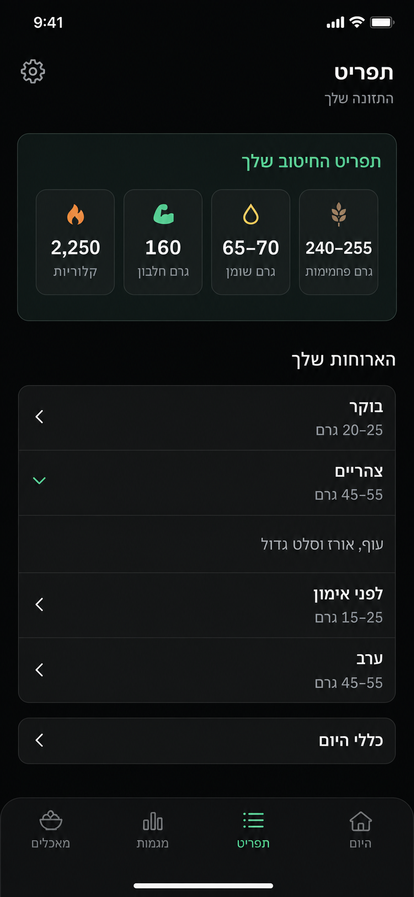

- יעדי היום נשארים בראש המסך בארבעה תאים קומפקטיים.
- ארוחות עוברות לרשימת disclosure: כותרת, טווח חלבון ושורת תקציר. פתיחה מציגה את המלל המלא והחלופות.
- `כללי היום` הוא disclosure נפרד בתחתית.
- אין כפתור הוספה צף במסך זה.

### 4. מאכלים

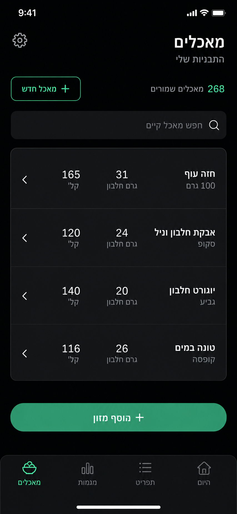

- ספירה ו־`מאכל חדש` מעל שדה חיפוש קבוע.
- הרשימה היא משטח מאוחד עם מפרידים, במקום כרטיס נפרד לכל מאכל.
- כל שורה מציגה מידה, `חלבון` ו־`קל׳` במפורש. לחיצה פותחת עריכה; אין עיפרון קבוע בכל שורה.

### 5. הוספה מהירה

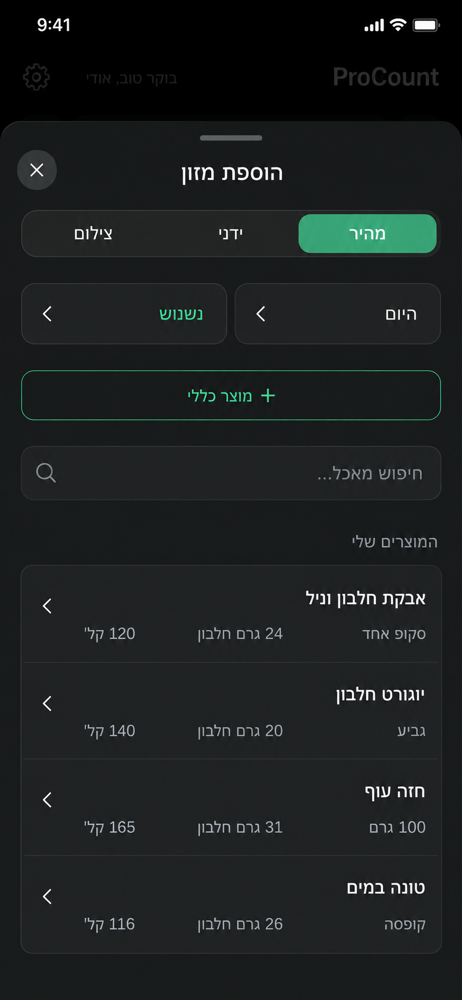

- ה־sheet שומר על שלושת המצבים: מהיר, ידני וצילום.
- תאריך וארוחה הופכים לשני controls קומפקטיים בראש ה־sheet.
- חיפוש ורשימת מאכלים בעמודה אחת נשארים.
- לחיצה על מאכל עוברת לבחירת כמות; אין שמירה אוטומטית לפני שהכמות ברורה.

### 6. הוספה ידנית

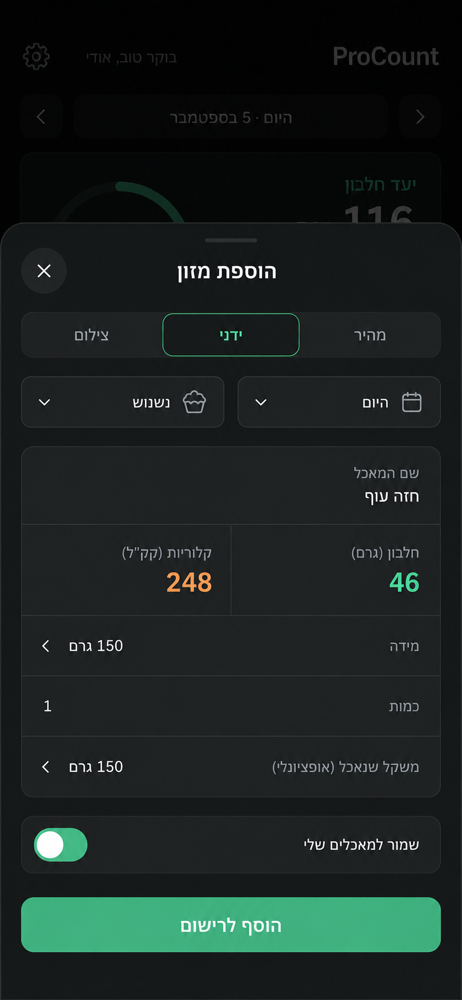

- הטופס מחולק ל־שם, ערכים, מידה וכמות בתוך grouped form.
- חלבון וקלוריות מקבלים צבע סמנטי, אך גם label מפורש.
- `שמור למאכלים שלי` הוא switch מוכר.
- CTA דביק בתחתית ה־sheet נשאר נגיש גם כשהמקלדת פתוחה.

### 7. הוספה מצילום

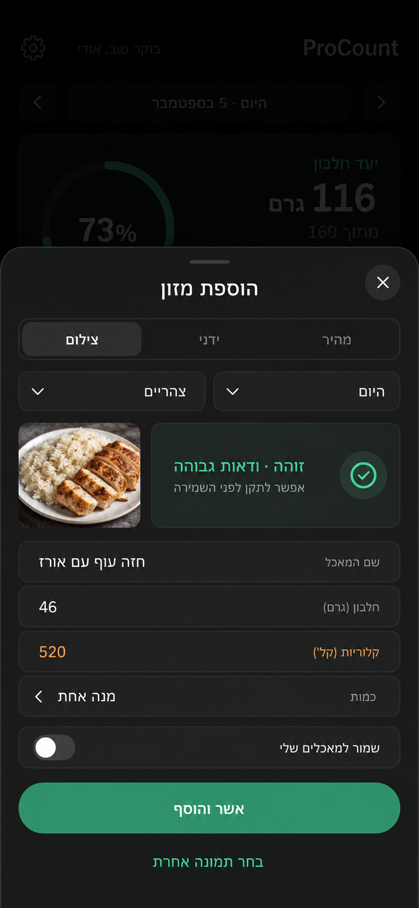

- לאחר הניתוח מוצגים thumbnail, ודאות והנחת AI קצרה.
- כל השדות נשארים ניתנים לעריכה לפני השמירה.
- החלפת תמונה היא פעולה משנית; `אשר והוסף` היא הפעולה הראשית היחידה.
- שגיאה או מכסה מלאה משאירות את הטופס והקלט הזמין במקום לאפס את המשתמש.

### 8. עורך מאכל

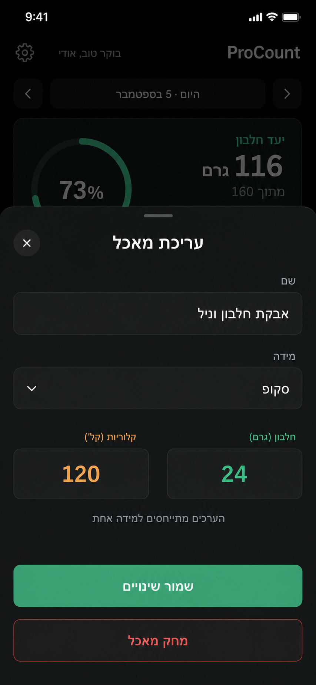

- אותו דפוס sheet ואותם שדות של ההוספה הידנית.
- במצב עריכה אין כפתור AI; במצב יצירה הוא מופיע רק לאחר שיש שם ומידה.
- מחיקה מופרדת מה־CTA הראשי ומובילה לדיאלוג האישור הקיים.

### 9. פרטי רישום

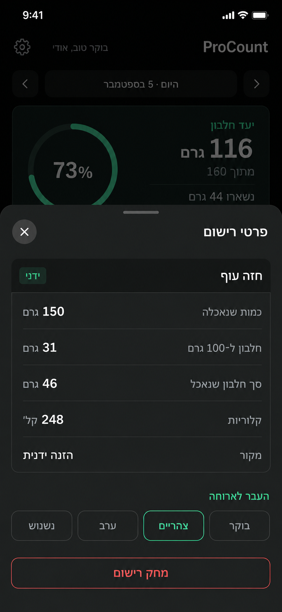

- נתוני הכמות והמאקרו מוצגים כ־grouped list אחד עם מפרידים.
- העברה בין ארוחות נשארת פעולה ישירה עם מצב נבחר ברור.
- מחיקה היא פעולה אדומה נפרדת בתחתית ה־sheet.

### 10. הגדרות

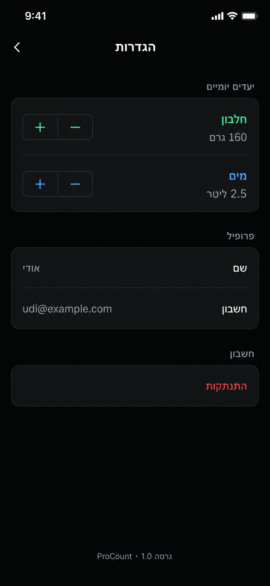

- יעדי חלבון ומים מאוחדים לקבוצת `יעדים יומיים` עם steppers קומפקטיים.
- שם וחשבון נמצאים בקבוצת `פרופיל`.
- התנתקות מקבלת קבוצה נפרדת וצבע סכנה.
- אין ניווט תחתון במסך ההגדרות.

### דיאלוג מחיקה

הדיאלוג אינו מסך עצמאי ולכן אינו מקבל המחשה נפרדת. הוא נשאר alert ממורכז עם `ביטול` ו־`מחק`, ללא tap-outside בזמן שהבקשה מתבצעת.

## תנועה ומשוב

- לחיצה: משוב ב־pointer-down, `scale(.97)` למשך כ־`100ms`.
- עדכון חלבון/מים: מעבר מהערך המוצג הנוכחי, damping קריטי וללא bounce, response של `0.35s`.
- פתיחת sheet: response של `0.3s`; bounce עדין רק אם המשתמש גרר ושחרר במהירות.
- אם מוצג grab handle, הגרירה חייבת להיות 1:1, ניתנת להפסקה ולהיפוך, עם handoff של מהירות. אחרת מסירים את הידית.
- כניסה ויציאה עוברות באותו מסלול. מעבר תאריך נע בכיוון היום שנבחר.
- `prefers-reduced-motion`: crossfade קצר ללא slide, spring או overshoot.
- `prefers-reduced-transparency`: header, tab bar ו־sheets עוברים לרקע כמעט אטום ללא blur.
- `prefers-contrast: more`: רקע אטום יותר וגבול ברור סביב controls.

## נגישות ו־RTL

- כל יעד מגע לפחות `44×44px`; כפתור סגירה וכפתורי +/- אינם נשארים בגודל 34px.
- צבע לעולם אינו הסמן היחיד: `בקצב טוב`, `חריגה`, `פעיל` ו־errors מופיעים גם בטקסט.
- מאקרו נכתב כ־`24 גרם חלבון` ו־`120 קל׳`; מספרים טכניים מקבלים `bdi` או `dir="ltr"` לפי הצורך.
- layout משתמש ב־logical properties (`inset-inline`, `padding-inline`) ולא בהיפוך ידני לפי צד.
- יש לשמור על קריאות ב־Dynamic Type מוגדל, בשמות מאכלים ארוכים וב־viewport של 320–480px.
- focus-visible, labels, aria-live לסטטוס ו־aria-busy לשמירה נשמרים בכל המצבים.

## תכנית עבודה — 11 שלבים

כל שלב מתאים להמחשה אחת, לפי סדר התמונות `00`–`10`. התכנית בלבד מוכנה; כל משימות הביצוע להלן טרם בוצעו. אין בתכנית אישור לפריסה או לשינוי מודל הנתונים.

### כללי עבודה משותפים

- מיישמים לפי שפת `apple-design` שהוגדרה לעיל: היררכיה ברורה, ריווח, קבוצות תוכן ומשוב עדין. שומרים על עברית, RTL, Heebo ומצב כהה.
- משתמשים בקומפוננטות, באייקונים ובדפוסי העיצוב שכבר קיימים. נשארים ב־JS וב־inline styles; `src/index.css` מיועד לכללים גלובליים, נגישות ואנימציות. אין ספריית UI או שכבת abstractions חדשה.
- כל שלב כולל את המצבים הרלוונטיים לו: טעינה, ריק, הצלחה, שגיאה ופעולה ממתינה. נגישות ותנועה נבדקות בתוך השלב, לא נדחות לסוף.
- בכל שלב: צילום לפני/אחרי ב־390×844, בדיקת 320–480px, מקלדת ו־RTL; הרצת `npm test`, `npm run build` ו־`git diff --check`. בדיקות אלו יתבצעו בזמן היישום, לא נחשבות כבוצעו בעקבות כתיבת התכנית.
- שומרים על שינוי נפרד וניתן לסקירה לכל מסך. אחרי שלבים 3, 5, 8 ו־11 משווים את המסכים יחד לאחידות ולרגרסיות. שינוי בקומפוננטה משותפת מחייב בדיקת כל המשתמשים בה.

### שלב 1 — כניסה והרשמה

**המחשה:** [00-login.png](../../design/apple-ui-redesign/00-login.png) · **תלות:** אין.

**קבצים:** `src/Login.jsx`, `src/index.css`; שימוש בהגדרות עיצוב קיימות אם ישנן.

- [x] להחיל את צבעי הבסיס, הטיפוגרפיה והמרווחים הדרושים למסך הראשון, בלי לבנות ספריית עיצוב חדשה.
- [x] לעצב כותרת קצרה, טופס מקובץ ופעולה ראשית ברורה; לשמר מעבר בין כניסה להרשמה ואת זרימת האימות הקיימת.
- [x] להוסיף labels נגישים, focus נראה, שגיאה צמודה לטופס ומצב שליחה שאינו מאפשר לחיצה כפולה. שדות אימייל וסיסמה נשארים LTR עם autocomplete מתאים.

**תנאי סיום ואימות:** שתי תצוגות הטופס תקינות עם מקלדת פתוחה, סיסמה שגויה ושליחה ממתינה; ה־CTA אינו מוסתר. אין הוספת שחזור סיסמה או שינוי ב־Supabase/auth כחלק מהעיצוב.

### שלב 2 — היום

**המחשה:** [01-today.png](../../design/apple-ui-redesign/01-today.png) · **תלות:** שלב 1.

**קבצים:** `src/screens/Today.jsx`, `src/App.jsx`, `src/index.css`.

- [x] לעצב את המעטפת המשותפת: כותרת יחידה, ניווט תחתון ופעולת הוספה, תוך שימור מנגנון ה־safe-area הקיים.
- [x] לרכז חלבון וקצב בכרטיס ראשי קומפקטי; להציג קלוריות ומים בכרטיסים משניים ולתת עדיפות ליומן הארוחות בהמשך.
- [x] לשמר בחירת יום, ארבע קבוצות ארוחה, פירוט פריט, מצבי יום ריק ויעד שהושג. אין להציג קצב של היום בתאריך היסטורי.
- [x] לשמר הוספת מים 250/500/700 מ״ל, כמות מותאמת, ביטול ושגיאות; אפשר לרכז אפשרויות תחת ״אחר״ אך לא להסירן.
- [x] אם ההמלצה מקבלת פעולה, היא תפתח את זרימת ההוספה המהירה הקיימת; לא תבצע שמירה אוטומטית של כמה מאכלים.

**תנאי סיום ואימות:** ביום עם רשומות, תחילת היומן נראית ב־390×844 ללא גלילה; אין חפיפת CTA ותוכן. בודקים יום ריק/עמוס, יום קודם, חריגה מהיעד וכל פעולות המים. כל המספרים נגזרים מה־view-model, לא מהתמונה.

### שלב 3 — מגמות

**המחשה:** [02-trends.png](../../design/apple-ui-redesign/02-trends.png) · **תלות:** שלב 2.

**קבצים:** `src/screens/Trends.jsx`; `src/App.jsx` רק להתאמת הצגה במעטפת אם נדרש.

- [x] לאחד כותרת, בורר שבוע/חודש, ממוצע וגרף לאזור ראשי אחד; להעביר רצף וממוצע קלוריות לכרטיסים משניים.
- [x] לשמר את סדר התאריכים, קו היעד והנתונים הקיימים. גרף חודשי אינו הופך אוטומטית את הממוצעים השבועיים לממוצעים חודשיים: הכותרות יציינו זאת במפורש.
- [x] לא להעתיק את תובנת ״עלייה של 8%״ מההמחשה — אין לה חישוב קיים. להסיר גרף קישוט שאינו מבוסס נתונים במקום להציגו כמדידה.
- [x] לתת לגרף תיאור נגיש וערכים קריאים, בלי להסתמך רק על גובה עמודה או צבע.

**תנאי סיום ואימות:** מעבר שבוע/חודש, שבוע ללא נתונים ונתונים חלקיים מוצגים ללא ממוצע מטעה או השוואה מומצאת. משווים נתונים לתצוגה הקיימת ובודקים אחידות של מסכים 1–3.

### שלב 4 — תפריט

**המחשה:** [03-meal-plan.png](../../design/apple-ui-redesign/03-meal-plan.png) · **תלות:** שלב 2; מבוצע אחרי שלב 3 בסדר המסירה.

**קבצים:** `src/screens/MealPlan.jsx`, `src/App.jsx` לתצוגת המעטפת בלבד.

- [x] לעצב סיכום של ארבעת ערכי היעד וקבוצות ארוחה שניתן לפתוח ולסגור באמצעות controls נגישים.
- [x] לשמר את מלוא הנוסח הקיים, הכמויות, המידות הביתיות וחמש הקבוצות, כולל אבקת החלבון. הקיצור בתמונה אינו אישור למחיקת תוכן.
- [x] להשאיר את התפריט הנחיה סטטית; לא לחבר את יעדיו לפרופיל או לרשומות היומיות.
- [x] להסיר פעולת הוספה צפה מהמסך; לשמר ניווט ושמירה על מיקום גלילה בזמן פתיחת קבוצה.

**תנאי סיום ואימות:** השוואה מול כל הטקסט בקוד מוכיחה שלא אבד תוכן; פתיחה וסגירה עובדות במגע ובמקלדת, עם `aria-expanded`, גם בטקסט מוגדל.

### שלב 5 — המאכלים שלי

**המחשה:** [04-my-foods.png](../../design/apple-ui-redesign/04-my-foods.png) · **תלות:** שלב 2; מבוצע אחרי שלב 4.

**קבצים:** `src/screens/MyFoods.jsx`.

- [x] לעצב חיפוש, מספר תוצאות ופעולת ״מאכל חדש״ מעל רשימה מקובצת חד־עמודתית.
- [x] להפוך את שורת המאכל לפעולת עריכה נגישה, עם שם, מידה וערכי חלבון/קלוריות קריאים.
- [x] להשתמש בחיפוש ובנרמול הקיימים; להבדיל בין קטלוג ריק לבין חיפוש ללא תוצאות.
- [x] לשמר פתיחת העורך הקיים בלבד: בחירת מאכל כאן אינה רישום אכילה ואינה משנה את מודל הקטלוג המשותף.

**תנאי סיום ואימות:** חיפוש בעברית, ניקוי חיפוש, שם ארוך ופתיחת מאכל חדש/קיים תקינים. סוקרים יחד את ארבעת הטאבים ומוודאים שאין כותרות כפולות או חפיפת ניווט.

### שלב 6 — הוספה מהירה

**המחשה:** [05-add-quick.png](../../design/apple-ui-redesign/05-add-quick.png) · **תלות:** שלבים 2 ו־5.

**קבצים:** `src/screens/AddSheet.jsx`, `src/index.css`; `src/App.jsx` רק לחיבורי המעטפת הנדרשים.

- [x] לעצב את מעטפת ההוספה המשותפת לשלושת המצבים: כותרת, סגירה, טאבים ובחירת יום/סוג ארוחה.
- [x] לעצב חיפוש ורשימת מאכלים בעמודה אחת, ולאחר בחירה להציג כמות וסיכום לפני אישור.
- [x] לשמר חישובי מנות/גרמים, יום היעד, סוג הארוחה והתנהגות השמירה הקיימים.
- [x] לטפל בפוקוס בתוך החלונית ובהחזרתו לסגירה, במקלדת ובגלילה. לא להציג ידית גרירה אם אין מחוות גרירה אמיתית.

**תנאי סיום ואימות:** הוספה להיום וליום קודם, שינוי כמות, אין תוצאות, שגיאת שמירה ולחיצה חוזרת אינם משנים יעד או יוצרים כפילות. בודקים גם פתיחת הטאבים הידני והצילום לאחר שינוי המעטפת המשותפת.

### שלב 7 — הוספה ידנית

**המחשה:** [06-add-manual.png](../../design/apple-ui-redesign/06-add-manual.png) · **תלות:** שלב 6.

**קבצים:** `src/screens/AddSheet.jsx`, בפרט `ManualForm` הקיים.

- [x] לקבץ שם, חלבון וקלוריות; להפריד בין ערכים למנה לבין כמות ומידה, ולהציג את הסיכום המחושב הקיים.
- [x] לשמר מידה מותאמת, משקל אופציונלי ואת תנאי החובה הקיימים; להציג שגיאות סמוך לשדה המתאים.
- [x] לעצב את השמירה לקטלוג כבחירה מפורשת. ברירת המחדל נשארת כבויה, גם אם המתג בהמחשה דלוק.
- [x] להצמיד את פעולת השמירה לתחתית החלונית בלי להסתיר שדות, הודעות או תוכן בעת פתיחת מקלדת.

**תנאי סיום ואימות:** בודקים אפס, מספר שלילי, כמות לא תקינה, מידה מותאמת חסרה ושמירה חלקית/ניסיון חוזר לפי ההתנהגות הקיימת. מאחר ש־`ManualForm` משותף, מאמתים גם תוצאת צילום ללא שינוי לוגיקת האימות.

### שלב 8 — הוספה מתמונה

**המחשה:** [07-add-photo.png](../../design/apple-ui-redesign/07-add-photo.png) · **תלות:** שלבים 6–7.

**קבצים:** `src/screens/AddSheet.jsx`.

- [x] לעצב בחירה ממצלמה או מגלריה, תצוגה מקדימה, מצב ניתוח ותוצאה ניתנת לעריכה.
- [x] להציג confidence והערה כפי שחוזרים כיום, בלי לייצר תחושת דיוק ודאית. לשמר החלפת תמונה, הנחיות וטיוטה לאורך הזרימה.
- [x] להשתמש בטופס הקיים לשם ולערכי התזונה. ״מנה אחת״ בהמחשה אינה סיבה להוסיף חישוב כמויות חדש לתוצאת AI.
- [x] לשמר את מצבי מכסה יומית, שגיאת ניתוח/רשת/אימות והמעבר להזנה ידנית; שמירה לקטלוג נשארת opt-in.

**תנאי סיום ואימות:** בודקים בחירה, ביטול, החלפת צילום, עריכת תוצאה ושמירה; מכסה ושגיאות נבדקות בתרחישים מבוקרים ללא שינוי השרת. סוקרים יחד את שלוש שיטות ההוספה, כולל טיוטות, פוקוס ו־CTA. בדיקה עם תוצאה מדומה אינה הוכחת ניתוח AI חי.

### שלב 9 — עורך מאכל

**המחשה:** [08-food-editor.png](../../design/apple-ui-redesign/08-food-editor.png) · **תלות:** שלבים 5–7.

**קבצים:** `src/FoodEditor.jsx`; `src/ConfirmDialog.jsx` רק להתאמת העיצוב והנגישות המשותפים.

- [ ] ליישר את העורך עם שפת טופס ההוספה: שם, מידה, חלבון וקלוריות בקבוצות ברורות ושמירה נגישה.
- [ ] לשמר את ההבחנה בין יצירה לעריכה; אפשרות הערכת AI נשארת רק ביצירת מאכל חדש.
- [ ] לשמר טיוטה, נעילות, הודעות על שימוש ברשומה קיימת והתנהגות ניסיון חוזר לאחר שמירה חלקית.
- [ ] לעצב פעולה הרסנית בנפרד ואת דיאלוג האישור הקיים; להוסיף טיפול בפוקוס בלי לעקוף אישור, נעילה או הודעת שגיאה.

**תנאי סיום ואימות:** יצירה, עריכה, ביטול, ניסיון חוזר ומחיקה עם אישור תקינים; סגירה אינה מוחקת נתון שכבר נשמר. שינוי בדיאלוג נבדק גם מול מחיקת רשומת אכילה.

### שלב 10 — פרטי רשומת אכילה

**המחשה:** [09-entry-detail.png](../../design/apple-ui-redesign/09-entry-detail.png) · **תלות:** שלבים 2 ו־9.

**קבצים:** `src/ItemDetailModal.jsx`; שימוש ב־`src/ConfirmDialog.jsx` הקיים.

- [ ] לעצב כותרת מאכל ונתוני תזונה לקריאה בלבד, עם קבוצות לכמות, חלבון ל־100 גרם, סך חלבון, קלוריות ומקור.
- [ ] לשמר `—` כשמשקל או ערך נגזר אינם זמינים; לא להסיק משקל שלא קיים ברשומה.
- [ ] להציג שינוי סוג ארוחה כפעולה נפרדת עם הבחירה הנוכחית, ולשמר מצבי שמירה ושגיאה.
- [ ] להפריד מחיקה מהתוכן ולהעבירה דרך דיאלוג האישור; להחיל את כללי הפוקוס והסגירה של החלוניות.

**תנאי סיום ואימות:** רשומות ידניות/שמורות/AI, רשומה ותיקה ללא גרמים ושם ארוך מוצגים נכון. שינוי ארוחה מתעדכן ביומן; מחיקה שבוטלה אינה משנה נתונים ושגיאה נשארת גלויה.

### שלב 11 — הגדרות וסגירת האימות הרוחבי

**המחשה:** [10-settings.png](../../design/apple-ui-redesign/10-settings.png) · **תלות:** שלבים 1–10.

**קבצים:** `src/screens/Settings.jsx`, `src/App.jsx` למעטפת בלבד; תיקונים חזותיים נקודתיים במסכים קודמים רק אם התגלתה רגרסיה.

- [ ] לקבץ יעדי חלבון ומים עם steppers, שם וחשבון תחת פרופיל, והתנתקות באזור נפרד.
- [ ] לשמר טווחי יעד וצעדים קיימים, שמירת שם והתנהגות שגיאות; אין שינוי בפרופיל או בשכבת הנתונים.
- [ ] להסיר ניווט תחתון ו־FAB מהגדרות, וליישר חזרה/סגירה עם RTL ועם יתר האפליקציה — לא להעתיק כיוון חץ שגוי מתמונה.
- [ ] לבצע מעבר מלא בכל 11 המסכים: התאמה חזותית, RTL, ניווט במקלדת, VoiceOver, טקסט מוגדל, reduced motion/transparency/contrast, מצבי ריק ושגיאה.
- [ ] להריץ את הבדיקות וה־build, ולאמת ב־iPhone פיזי כ־PWA מותקן: cold launch, portrait/landscape, מקלדת, פתיחה וסגירה של חלוניות ו־relaunch.

**תנאי סיום ואימות:** יעדים בגבולות הטווח, שם ריק/ארוך, חזרה והתנתקות עובדים כקודם; אין חפיפות תוכן או controls בכל המסכים. מוסרים צילומי אחרי ורשימת בדיקות עם ״עובר״/״נכשל״/״לא נבדק״. בלי בדיקת מכשיר, מסמנים אותה ״לא נבדק״ ולא מצהירים שה־PWA אומת; אין פריסה אוטומטית.

## תנאי קבלה

- `npm test`, `npm run build` ו־`git diff --check` עוברים.
- אין שינוי ב־Supabase, ב־nutrition math או בהתנהגות שמירה/מחיקה ללא אישור נפרד.
- כל הזרימות נבדקות עם יום ריק, יום עמוס, תאריך היסטורי, שם מאכל ארוך, שגיאת רשת ותוצאת AI ניתנת לעריכה.
- אין חפיפה בין CTA, מקלדת, tab bar, Home indicator או תוכן גלילה.
- בדיקת דפדפן אינה נחשבת הוכחה ל־standalone: יש לבצע cold launch, portrait/landscape, keyboard, sheets ו־relaunch על iPhone פיזי.

## גבולות ההמחשות

ה־PNGים הם reference לקומפוזיציה, היררכיה, צבע וחומריות. ImageGen עלול לשנות אות או סימן RTL; המחרוזות המדויקות במסמך ובקוד הן מקור האמת. ההמחשות אינן הוכחת יישום, נגישות או התנהגות תנועה.
